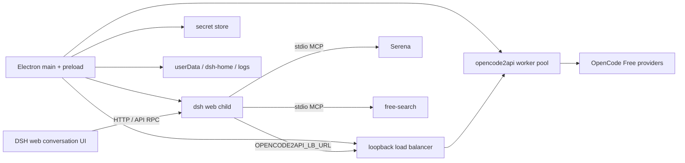

# Architecture

FreeCode DeepSeek Harness is a Windows Electron shell around the upstream
DeepSeek Harness web application. The shell owns native lifecycle, the local
OpenCode-compatible pool, secrets, model discovery, MCP configuration,
packaging and tray/UI affordances. The upstream subtree owns the agent runtime
and conversation web product.



## Runtime sequence

1. Electron resolves development resources or packaged `resources/freecode`.
2. The shell starts the local worker pool and loopback load balancer.
3. The supervisor starts `dsh web --host 127.0.0.1 --port 0 --no-open` with a
   whitelisted environment and waits for its authenticated readiness URL.
4. The shell opens one hardened `BrowserWindow` with context isolation, no Node
   integration, renderer sandboxing and the preload bridge.
5. Provider seeding maintains the OpenCode Free route and removes only the
   managed legacy `gemini-web` route. Gemini2API is not started, packaged or
   exposed by 0.5.0.
6. The managed MCP catalog is materialized under `dsh-home/mcp/servers.json`.
   Standard mounts Serena and free-search only when their persisted flags are
   enabled. The bridge reports a server ready only after
   `initialize → tools/list → schema validation → registration`.
7. Serena receives the canonicalized session workspace immediately before its
   first tool call for that workspace. Activation and the dependent call share
   one serialized queue, so concurrent sessions cannot switch Serena between
   activation and use.

## Process ownership and headless policy

- `apps/shell/src/main/index.ts`: Electron lifecycle, one native window, tray,
  menus, notifications, updater and logging.
- `apps/shell/src/main/runtime.ts`: composition of pool, load balancer,
  supervisor and live MCP status projection.
- `apps/shell/src/main/harness-supervisor.ts`: readiness, generations, restart
  budget, tree termination and no-window child spawning.
- `packages/opencode-adapter`: worker spawn, health, respawn, round-robin and
  process-tree termination.
- `packages/shared-types`: zod-backed IPC and runtime status contracts.
- `vendor/deepseek-harness`: upstream runtime and web client, kept as a subtree.
- `vendor/deepseek-harness/packages/mcp/mcp-client`: MCP initialization,
  schema discovery, project activation and classified tool-call bridge.
- `vendor/deepseek-harness/packages/llm/llm/src/ocr.ts`: bounded direct OCR
  helper used by text-only image paths.

All implementation children use `windowsHide:true` and `shell:false`. The shell
does not use `cmd.exe`, `start`, a terminal window or a browser to implement
background work. The supervisor and worker pool track process generations,
coalesce pending spawns and wait for the old tree to exit before replacement.

## MCP configuration and observability

The managed files are:

```text
<userData>/dsh-home/mcp/servers.json
<userData>/dsh-home/cordis.patch.yml
```

Settings → Plugins → MCP exposes toggles, live state, tool count, errors and
the config path. The tray shows the count of enabled MCP servers that are
ready. A failed connection produces a native notification once per failure
state and remains visible in the tab and app log. The generated block is
atomic and unrelated user patch rows are preserved.

## Model-facing output compression

The Bash and Windows PowerShell providers expose independent RTK and Caveman
settings. Both schema toggles default to enabled; each wrapper is a no-op when
its executable is not installed. RTK remains optional and is never advertised
as used merely because its setting is enabled. Only eligible plain commands are
wrapped; pipes, redirects, substitutions and other shell syntax remain
unchanged. FreeCode does not silently install either external optimizer.

## OCR boundary

Windows packaging includes Tesseract and English trained data under
`resources/freecode/tesseract`. The helper receives a validated absolute image
path, bounded language/PSM arguments and a timeout. Image size, OCR output and
cache size are bounded; image bytes and OCR contents are never written to the
application log. Vision routes keep the image. Text-only routes receive OCR
text for both direct attachments and `read_image`, with explicit errors when
the helper is unavailable or returns empty/invalid output.

## Resource layout

```text
resources/freecode/
  opencode2api/<windows-binary>
  tesseract/tesseract.exe
  tesseract/*.dll
  tesseract/tessdata/eng.traineddata
  dsh/apps/cli/lib/bin.js
  dsh/packages/**/node_modules/@deepseek-ai/*
  runtime-manifest.json
```

The complete workspace install is deliberate: production-only dependency
installation can leave upstream workspace links unresolved and make boot fail.
Portable builds place `data/` beside the executable. NSIS uses the normal
per-user Windows application data path.

## Security boundaries

- The renderer receives only `window.freecode` from the isolated preload.
- Secrets are read from the host vault and injected into child environments;
  they are not copied into global `process.env`.
- Local services bind to loopback.
- MCP server arguments are arrays, not shell strings, and their stderr is
  bounded. Tool-call logs omit arguments and image data.
- OCR validates paths, size and output and does not log sensitive content.
- Upstream permission, sandbox, filesystem and confirmation policy remains
  authoritative. FreeCode does not silently widen sandbox access.
- The updater checks at startup and every six hours, uses an in-flight guard,
  and shows download/install progress through the tray and native notices.

## Upstream and modular patches

`vendor/deepseek-harness` is updated first. Product changes are then applied in
sorted `patches/upstream/*.patch` order by the idempotent, vendor-scoped patch
applier. The intended flow is:

```text
upstream fetch/subtree update
  → pnpm apply:upstream-patches
  → pnpm prepare:upstream
  → tests/typecheck/build/package
```

Patches are incremental: a later patch assumes earlier patches, never rewrites
the entire vendor tree, and must include a focused contract test. Direct vendor
edits are temporary working changes until represented by a patch. See
[`docs/UPSTREAM-PATCHING.md`](UPSTREAM-PATCHING.md).

## Windows release scope

0.5.0 publishes only Windows x64 NSIS and portable artifacts. Linux/macOS are
contributor-only manual builds and have no release gate, no binary upload and
no claim of parity. The final local gate is documented in
[`docs/ROADMAP-0.5.0.md`](ROADMAP-0.5.0.md).
